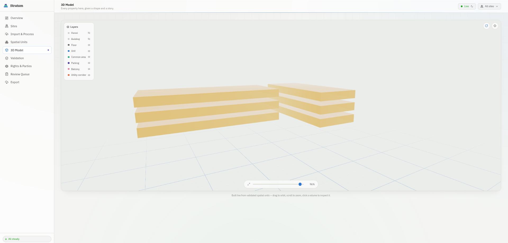

# Stratum (ULPIN-3D)

3D property identities and vertical mapping for land records. Stratum turns surface parcels into validated, versioned volumes (buildings, floors, units, common areas, utility corridors) that carry provenance, rights and a proposed 3D identifier.

Built for Smart India Hackathon 2026, problem statement SIH26011 (Ministry of Rural Development, Department of Land Resources). Team LE SSERAFIM.



## Why

A surface ULPIN names land, not the space above or below it. It cannot separate a flat on the fifth floor, a shared corridor, a basement or a water main under the same plot. Stratum keeps the official parent ULPIN and adds geometry, height and hierarchy beneath it.

```
IN-ULPIN3D / <14-char parent ULPIN> / UNIT / F05-U501 / v01
```

The identifier is a proposed extension. It is never presented as an official DoLR ULPIN or as legal title.

## How it works

```
GeoJSON / LAS-LAZ / DSM-DTM  ->  FastAPI  ->  PostGIS + SFCGAL  ->  React + three.js viewer
                                    |                                 GeoJSON / glTF / CityGML LOD1
                       ingest -> model -> validate -> review -> issue
```

1. **Ingest.** Explicit EPSG required and never guessed. Reprojected to EPSG:32643, vertical reference declared, SHA-256 checksum stored.
2. **Model.** Classical height and footprint estimation from point clouds or rasters. Floors come from supplied plans, declared storeys, or assumed-height bands. Utilities become buffered prisms. SFCGAL builds solids and volumes.
3. **Validate.** 11 topology rules (containment, Z-range, unit overlap, floor gaps, and more) set each unit to VALID, INVALID or DEGRADED.
4. **Review and rights.** Estimated geometry stays DEGRADED until a human approves it with a reason and evidence. Rights, restrictions and responsibilities attach to spatial units as claims.
5. **Issue and export.** A proposed ID is issued only for VALID units. Records are versioned, and exported as GeoJSON, glTF 2.0, CityGML 2.0 LOD1 (buildings) or an HTML record card.

## Run it

Requires Docker. The full stack starts with:

```bash
docker compose up --build
```

API at http://localhost:8000 (docs at `/docs`), PostGIS on port 5433. Then the React interface:

```bash
cd frontend
npm install
npm run dev        # http://localhost:5173
```

Set `VITE_API_BASE` if the API is not on `localhost:8000`.

For a clean, pre-seeded presentation stack on its own database:

```bash
docker compose -f docker-compose.demo.yml up -d --build
```

Open http://localhost:8001/demo. See [DEMO.md](DEMO.md) for the four-minute walkthrough and the DSCE campus field case.

## Interface

Overview, Sites, Import and Process, Spatial Units, 3D Model, Validation, Rights and Parties, Review Queue, Export. The 3D Model page extrudes each unit from its validated footprint and height, with layer toggles, an explode slider, status colouring and a side panel for issuance and review. A live event feed (Server-Sent Events) shows what the API is doing.

## Stack

| Layer      | Technology                                                            |
| ---------- | --------------------------------------------------------------------- |
| API        | FastAPI, SQLAlchemy, Pydantic (51 routes)                             |
| Data       | PostgreSQL 16, PostGIS 3.5, SFCGAL, storage SRID 32643                |
| Geospatial | Shapely, PyProj, Rasterio, Laspy                                      |
| Frontend   | React 18, Vite, Tailwind, three.js (react-three-fiber), Framer Motion |
| Deployment | Docker Compose                                                        |

## Evidence and tests

- 117 backend tests across ingest, elevation, imagery, survey, validation, review, rights, lifecycle and pipeline. Run `cd backend && pytest` with the compose database up.
- A reproducible three-building check on public New York LiDAR and footprints reports median footprint IoU 0.593 and median height error 0.20 m. It is a small sample, not an accuracy certification. Details in [data/public/nyc_2017_945172](data/public/nyc_2017_945172/README.md).
- An opt-in evaluation harness (`python -m app.evaluation`) compares estimates with independent reference geometry.

## Scope and limits

- The presentation scene is synthetic (Kothrud, Pune). The parent ULPIN in demos is a labelled placeholder.
- Height and floor estimation is classical, not a trained model. Confidence values are heuristic. Floor bands are proposals and are never described as surveyed or LiDAR-observed slabs.
- Drone orthophotos and GNSS/CORS control points are recorded as evidence only. There is no live CORS integration.
- CityGML export covers building envelopes. Legal spaces stay in PostGIS, aligned with ISO 19152 LADM but not certified against it.
- Reviewer labels and rights entries are operator assertions, not authenticated identities or verified title.

## Repository layout

```
backend/    FastAPI app, pipeline, SQL schema, tests
frontend/   React interface and the scripted demo page
data/       Demo scenes, example imports, public-data check
assets/     Images used in this README
```
